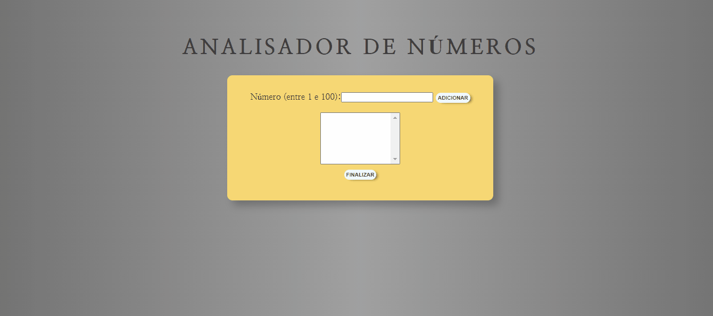
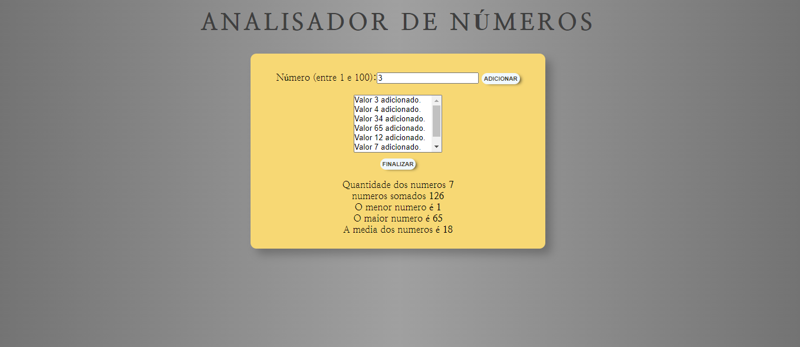

# Analisador de Números

O projeto se trata de um analisador de números. Colocando qualquer número de 1 a 100 no input e apertando no botão ao lado, ele adiciona na página e ao finalizar o processo, irá mostrar os números somados, o maior deles, o menor, a média e a quantidade de números.

## Menu

- [Screenshot](#screenshot)
- [Links](#links)
- [Feito com](#feito-com)
- [o que aprendi](#o-que-aprendi)
- [Contato](#contato)

### Screenshot

### Links

[Site do Projeto](https://bruno-nog.github.io/tabuada-js/)

### Feito com:

- HTML5
- CSS3
- JavaScript

### O que aprendi

O analisador foi feito com o objetivo de praticar JS e foi dado como último exercício do curso em video, sua estrutura e estilização é simples, pois o foco foi o JS. Dado o número, o programa adiciona o número no array e ao finalizar o processo, ele faz diversas operações com os números solicitados pelo usúario.

## Contato

